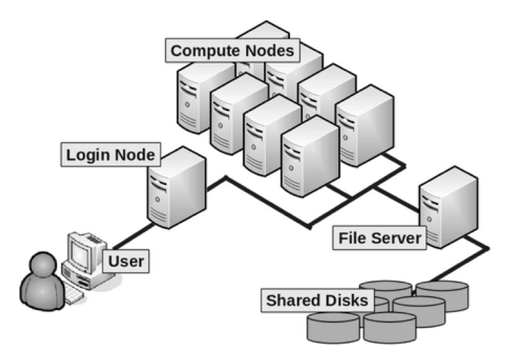

.. _what_is_hpc:

What Is High Performance Computing?
===================================

Introduction
------------

If you're new to high-performance computing (HPC), you might wonder: "What is HPC?"

High Performance Computing generally refers to the practice of aggregating computing power/resources to achieve much higher performance than is possible with a typical desktop computer.

In practice, the term "HPC" can be difficult to define concisely due to the varied characteristics of different software and hardware combinations that constitute HPC.

HPC can mean either "high performance computing" or "high performance computer," and the context usually makes this clear.

Users typically submit their workloads to a HPC cluster—a large computer system made up of many smaller computers. However, HPC clusters are not the only way to run such workloads; dedicated high-performance workstations can also be used.

Who Can Use or Should Use an HPC Cluster?
-----------------------------------------

Most desktop or laptop computers used by researchers have between 8 to 16 GB of memory, 4 to 16 CPU cores, and a few TB of disk space. HPC clusters, by contrast, typically offer an order of magnitude more resources. Researchers whose workloads exceed their local machine's memory, disk space, or processing capabilities often benefit from using HPC resources.

While the idea of using an HPC cluster may seem intimidating, any researcher whose workload exceeds the capacity of their desktop or laptop can use HPC resources, often with minimal training.

What Is an HPC Cluster?
-----------------------

An HPC cluster is a large system composed of many smaller servers (nodes). These nodes are interconnected, often using high-speed interconnects like `Intel Omnipath <https://www.intel.co.uk/content/www/uk/en/high-performance-computing-fabrics/omni-path-driving-exascale-computing.html>`_ to enable rapid data transfer.

age and processing.

   A general cluster schematic. Source: `Harvard Chan Bioinformatics Core <https://hbctraining.github.io/Intro-to-shell-flipped/lessons/08_HPC_intro_and_terms.html>`_

HPC clusters generally consist of:

* **Login nodes**: Users log in, edit, and transfer files, but should not run intensive programs.
* **Compute nodes**: Nodes where user jobs are run. They mount shared filesystems, making software and files accessible for jobs.
* **Large memory nodes**: Similar to compute nodes but with increased RAM for memory-intensive jobs.
* **GPU nodes**: Equipped with GPUs for tasks requiring acceleration, such as AI or machine learning. Jobs must specify GPU use in their resource request.
* **Reserved/specialist nodes**: Dedicated nodes, often with unique specifications, reserved for specific departments or research groups.
* **Storage nodes/filestores**: Provide storage for the cluster.

All nodes have similar components to consumer desktops/laptops—CPU cores, memory, disk space—but are significantly more powerful.

A job scheduler manages job submissions, ensuring fair resource allocation. Users can request interactive or batch jobs.

Login Nodes
^^^^^^^^^^^

The login nodes are your access point to the cluster for file operations and job submissions. They are accessible via SSH, but running intensive applications is usually prohibited.

Compute Nodes
^^^^^^^^^^^^^

Compute nodes execute user jobs and share mounted filesystems, ensuring consistent access to resources.

Large Memory Nodes
^^^^^^^^^^^^^^^^^^

These nodes are similar to standard compute nodes but with higher RAM, suitable for memory-intensive jobs.

GPU Nodes
^^^^^^^^^

GPU nodes include specialised graphics processing units (GPUs) for tasks like modelling and machine learning.

When Should I Use HPC?
----------------------

HPC resources are beneficial when:

* Your computations require more memory than available on your computer.
* You need to run the same program multiple times with different input data.
* Your program can run faster in parallel.
* You need GPU acceleration for your program.

When Shouldn't I Use HPC?
-------------------------

Low Volume Workloads
^^^^^^^^^^^^^^^^^^^^

If your workload is minimal, the time and effort to learn HPC skills may not be worthwhile.

Low Volume, Low Memory Serial Workloads
^^^^^^^^^^^^^^^^^^^^^^^^^^^^^^^^^^^^^^^

HPC does not guarantee faster processing for all tasks. Single-core, low-memory jobs often run faster on modern desktops/laptops.

For Training Purposes
^^^^^^^^^^^^^^^^^^^^^

HPC clusters are meant for research workloads, not training. For training options, please refer to :ref:`hpc_training`.

For Non-Legitimate or Non-Research Purposes
^^^^^^^^^^^^^^^^^^^^^^^^^^^^^^^^^^^^^^^^^^^

HPC clusters are for legitimate research only. Inappropriate use (e.g., cryptocurrency mining, personal storage misuse, unauthorised access) may lead to investigations per the University's IT Code of Practice. 

Account sharing is also prohibited, with violations resulting in similar investigations.

For more information, refer to `Sheffield Hallam Universities IT Policies and Regulations <https://sheffieldhallam.sharepoint.com/sites/3009/policies/SitePages/Main-IT-Policies.aspx>`_.
